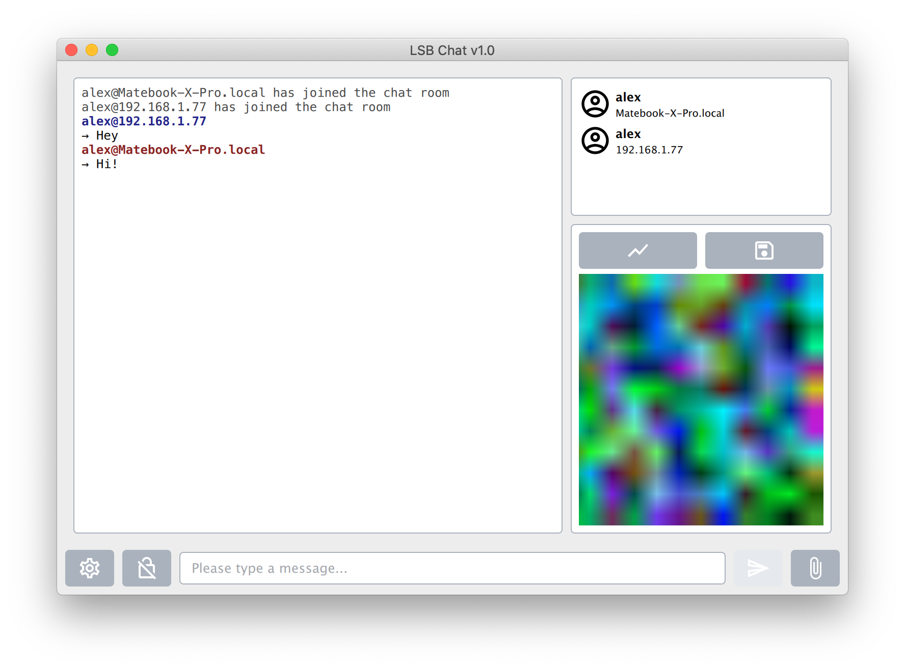

# LSB Chat

Experimental implementation of a secure message/file exchange platform over a local network.

The data is encrypted and subsequently hidden by LSB within an image, which is sent to a group chat on the LAN. The image is self-generated by the program with random colored pixels.

In order to read the original data, the user who receives the data must know the encryption password. Otherwise, he or she will not be able to read the received data.

### Project structture

- `src` contains the C++ source code.
- `doc` contains project documentation and screenshots.
- `assets` contains images, icons and QML interface-description files.
- `deploy` contains files specific for each target operating system.

### TODOs

- [ ] Implement networking module
- [ ] Implement LSB module
- [ ] Implement C++/QML bridge class
- [x] Implement user interface elements
- [ ] Software testing

### License

This project is released under the MIT licence, for more information, please click [here](LICENCE.md).

