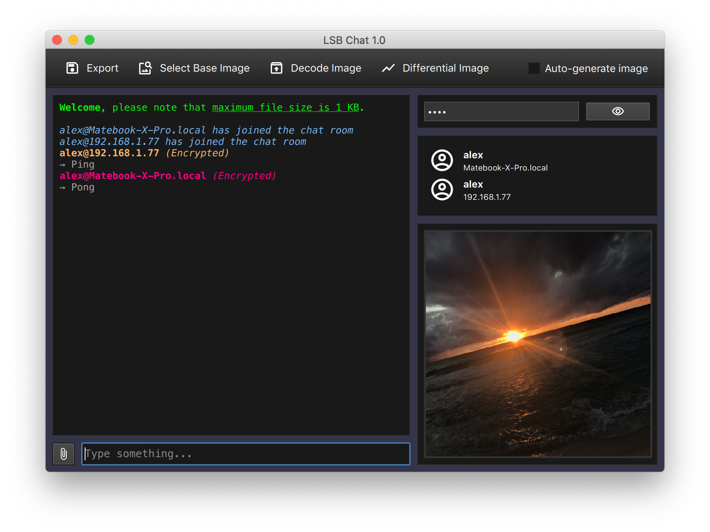

# LSB Chat

Experimental implementation of a secure message/file exchange platform over a local network.

The data is encrypted and subsequently hidden with an LSB steganography algorithm within an image, which is sent to a group chat on the LAN. The image can self-generated by the program with random colored pixels, or it can be selected by the user.

In order to read the original data, the user who receives the data must know the encryption password. Otherwise, he or she will not be able to read the received data.

<u>Note:</u> the project is loosely based on the [Network Chat Example](https://doc.qt.io/qt-5/qtnetwork-network-chat-example.html) developed by Digia/Qt.

### Project structture

- `src` contains the C++ source code.
- `doc` contains project documentation and screenshots.
- `assets` contains images, icons and QML interface-description files.
- `deploy` contains files specific for each target operating system.

### What is LSB Steganography?

**Definition of Steganography**

According to [Vangie Beal](https://www.webopedia.com/TERM/S/steganography.html), Steganography is "the art and science of hiding information by embedding messages within other, seemingly harmless messages". 

LSB steganography works by replacing the least significant bit with bits of different information. This hidden information can be just about anything. The goal of this project is to be able to share encrypted information over the LAN through images in a global chat room.

For example, here is a comparison between an image that has been "touched" by this program:

For more clarity, below you can find the image with only the pixels that have been modified to acommodate data (check the diagonal line of the image):

### TODOs

- [x] Implement networking module
- [x] Implement LSB module
- [x] Implement crypto module
- [x] Implement C++/QML bridge class
- [x] Implement user interface elements
- [ ] Software testing

### License

This project is released under the MIT licence, for more information, please click [here](LICENCE.md).

